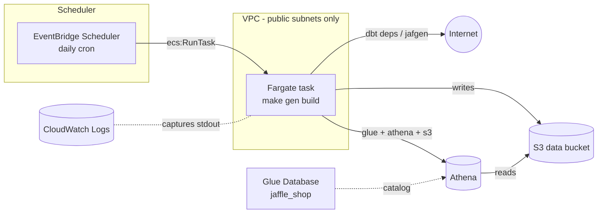

# Infra: running Jaffle Shop on AWS

This documents the AWS CDK app in `infra/`, which runs the dbt project on a
schedule instead of via dbt Cloud: a Fargate task builds the Docker image
from the repo root, runs the pipeline, and writes Iceberg tables to a Glue
Database queryable through Athena. An EventBridge Scheduler schedule
triggers the task once a day.

See the [README](README.md#%EF%B8%8F-running-in-aws-fargate--eventbridge-scheduler)
for the quick-start deploy commands. This doc goes deeper: what each piece
is for, and worked examples for the things you'll actually want to do —
trigger a run, read the logs, query the data, change the schedule, tear it
down.

## Table of contents

1. [Architecture](#architecture)
2. [Concepts](#concepts)
   1. [dbt targets: `dev` vs `prod`](#dbt-targets-dev-vs-prod)
   2. [Networking: public subnets, no NAT](#networking-public-subnets-no-nat)
   3. [The Docker image](#the-docker-image)
   4. [A task, not a service](#a-task-not-a-service)
   5. [Three IAM roles](#three-iam-roles)
   6. [Glue + Athena + Iceberg](#glue--athena--iceberg)
   7. [EventBridge Scheduler, not EventBridge Rules](#eventbridge-scheduler-not-eventbridge-rules)
   8. [Removal policy: this is a sandbox](#removal-policy-this-is-a-sandbox)
3. [Usage](#usage)
   1. [Prerequisites](#prerequisites)
   2. [First deploy](#first-deploy)
   3. [Reading the stack outputs](#reading-the-stack-outputs)
   4. [Redeploying after a change](#redeploying-after-a-change)
   5. [Running the task on demand](#running-the-task-on-demand)
   6. [Tailing the logs](#tailing-the-logs)
   7. [Querying the data in Athena](#querying-the-data-in-athena)
   8. [Changing the schedule](#changing-the-schedule)
   9. [Changing task size or command](#changing-task-size-or-command)
   10. [Tearing it down](#tearing-it-down)
4. [Troubleshooting](#troubleshooting)

## Architecture



The task has a public IP and reaches the internet directly (no NAT
Gateway); nothing reaches in. All AWS access — Glue, Athena, S3 — goes
through the task's IAM role, not network routing.

## Concepts

### dbt targets: `dev` vs `prod`

`dbt/profiles.yml` picks its target from the `DBT_TARGET` environment
variable, defaulting to `dev`:

```yaml
jaffle_shop:
  target: "{{ env_var('DBT_TARGET', 'dev') }}"
```

- **`dev`** — local DuckDB file (`jaffle_shop.duckdb`). What `make`/`task`
  use locally; untouched by any of this.
- **`prod`** — Amazon Athena. What the Fargate task uses (it sets
  `DBT_TARGET=prod` in its container environment). Points at the Glue
  Database and S3 bucket the CDK stack creates. You can also target this
  from your laptop against a deployed stack — see
  [Local environment variables](README.md#-local-environment-variables) in
  the README for the `.env`/direnv setup.

`dbt/dbt_project.yml` sets `+table_type: iceberg` at the project level for
both seeds and models. The DuckDB adapter ignores this config; the Athena
adapter uses it to create Iceberg tables instead of Hive tables — Iceberg
gives you schema evolution and safe concurrent writes, which matters once
something other than a single local dev run is touching the tables.

### Networking: public subnets, no NAT

The VPC (`infra/jaffle_shop_infra/stack.py`, `ec2.Vpc(..., nat_gateways=0)`)
has only public subnets. The task gets `assignPublicIp=ENABLED` and talks
to the internet directly through the VPC's internet gateway.

This is a deliberate cost/simplicity trade-off, not the default AWS
recommendation: a NAT Gateway costs money per hour plus per GB even when
idle, and this task has no inbound traffic to protect against (nothing
calls it — it calls out). If you later add something that *does* need to
be reachable, or you want the task on private subnets as a matter of
policy, that's a NAT Gateway (or VPC endpoints for S3/Glue/Athena/ECR to
avoid the NAT bill) — not a change to this doc's assumptions.

### The Docker image

The root `Dockerfile` installs the project with `uv`, copies in `dbt/` and
the `Makefile`, and defaults to `CMD ["make", "gen", "build"]` — regenerate
synthetic seed data, then seed/run/test. `infra/`'s `ecr_assets.DockerImageAsset`
builds this image and CDK pushes it to a CDK-managed asset ECR repo (there's
no hand-maintained ECR repo to look after).

The asset is built with `platform=ecr_assets.Platform.LINUX_AMD64` pinned
explicitly. Without this, the image builds for whatever architecture your
machine is (e.g. arm64 on Apple Silicon), while the Fargate task definition
defaults to X86_64 — a mismatch that fails at container start with an exec
format error, not at `cdk deploy` time. Pinning the platform means the
image always matches the task definition regardless of what machine (or CI
runner) runs `cdk deploy`.

### A task, not a service

This is `ecs.FargateTaskDefinition` + `ecs.Cluster`, with no
`ecs.FargateService`. A service keeps N copies of a long-running process
alive; this is a batch job that runs to completion once a day and exits.
Running it as a bare task (invoked directly by the scheduler via
`ecs:RunTask`) is the right primitive — a service would just restart the
container in a crash loop every time `dbt build` finished successfully.

### Three IAM roles

It's easy to conflate these; they're deliberately separate, least-privilege:

| Role | Assumed by | Used for |
|---|---|---|
| `DbtTaskRole` | `ecs-tasks.amazonaws.com` | What the *running dbt process* can do: read/write the S3 data bucket, read/write the Glue Database and its tables, run Athena queries against the `primary` workgroup. |
| execution role (auto-created by CDK on the task definition) | `ecs-tasks.amazonaws.com` | What *ECS itself* needs to start the container: pull the image from the asset ECR repo, write container stdout/stderr to the CloudWatch log group. Never touches your data. |
| `SchedulerExecutionRole` | `scheduler.amazonaws.com`, restricted to this account (`aws:SourceAccount` condition) | What *EventBridge Scheduler* needs to start the task: `ecs:RunTask` on this task definition family, and `iam:PassRole` for the two roles above (restricted via `iam:PassedToService=ecs-tasks.amazonaws.com` so it can't be used to pass arbitrary roles to arbitrary services). |

If you add a new AWS integration to the dbt project (say, an S3 bucket the
task needs to read from), it's `DbtTaskRole` you grant permissions to — not
the execution role, and not the scheduler role.

### Glue + Athena + Iceberg

- **Two Glue Databases** are the catalog namespaces — `jaffle_shop` (what
  Athena's `SHOW TABLES IN jaffle_shop` and dbt's `schema` config refer to,
  used by staging views and marts) and `raw` (seeds land here instead —
  `dbt/macros/generate_schema_name.sql` hardcodes seeds to a `raw` schema
  regardless of target). CDK creates both (`glue.CfnDatabase` x2) so they
  exist before the first task run; the task definition has an explicit
  `add_dependency(...)` on each to enforce that ordering in CloudFormation.
  The task role's Glue IAM policy is scoped to both databases — if you add a
  third schema to the dbt project, it needs a matching database + IAM update
  here.
- **Athena** is the query engine — dbt issues `CREATE TABLE AS SELECT` /
  `INSERT INTO` via Athena's `StartQueryExecution` API, and Athena reads
  and writes the actual Parquet/Iceberg files in S3. There's no database
  server to patch or scale; you pay per query.
- **S3** holds the actual bytes, under two prefixes in the one data bucket:
  `data/` (table data, `s3_data_dir` in `dbt/profiles.yml`) and
  `athena-results/` (query result staging, `s3_staging_dir`).
- **Iceberg** (`+table_type: iceberg`) is the table format layered on top —
  it's what gives you atomic writes, schema evolution, and time travel on
  top of plain Parquet-in-S3, which is what makes running `dbt build` with
  `--full-refresh` daily on a schedule safe.

### EventBridge Scheduler, not EventBridge Rules

There are two different AWS scheduling systems that both live under the
"EventBridge" name: **EventBridge Rules** (the older cron/rate
`scheduled-event` rules) and **EventBridge Scheduler** (a newer, separate
service with its own per-schedule execution role, flexible time windows,
and a wider set of "templated" targets). This stack uses the latter
(`aws_scheduler.CfnSchedule`), per what was asked for.

The ECS RunTask templated target has a specific shape worth knowing if you
ever hand-edit the CloudFormation: `Target.Arn` is the **ECS cluster**
ARN (not the task definition), and the task definition, launch type, and
network config all live under `Target.EcsParameters`. This mirrors how
EventBridge Rules target ECS RunTask, so it'll look familiar if you've
used those before.

### Removal policy: this is a sandbox

The data bucket and CloudWatch log group are both created with
`RemovalPolicy.DESTROY`, and the bucket additionally has
`auto_delete_objects=True`. That means `cdk destroy` actually removes
everything, including any Iceberg table data and query result files sitting
in the bucket — there's no safety net. That's intentional for a learning
project (cheap to nuke and recreate), and exactly the property you'd want
to remove first if you repurposed this stack for anything you'd mind
losing.

## Usage

All commands below assume you're in `infra/` with its venv activated:

```bash
cd infra
uv venv && uv pip install -r requirements.txt
source .venv/bin/activate
```

### Prerequisites

- Docker running locally (the CDK CLI builds the image at `cdk deploy`
  time — `cdk synth` only stages the build context, it doesn't invoke
  Docker)
- AWS credentials configured (`aws sts get-caller-identity` should work)
- Node.js (for `npx aws-cdk`)

### First deploy

```bash
npx aws-cdk@latest bootstrap    # once per AWS account/region
npx aws-cdk@latest deploy
```

`cdk bootstrap` sets up the CDK's own staging bucket/roles in your account;
skip it if you've already bootstrapped that account/region for other CDK
projects. `cdk deploy` will show you the IAM changes it's about to make and
ask for confirmation before creating anything.

### Reading the stack outputs

The stack exports the identifiers you'll need for everything below:

```bash
aws cloudformation describe-stacks \
  --stack-name JaffleShopStack \
  --query "Stacks[0].Outputs" --output table
```

Pull individual values into shell variables (used in the examples that
follow):

```bash
out() { aws cloudformation describe-stacks --stack-name JaffleShopStack \
  --query "Stacks[0].Outputs[?OutputKey=='$1'].OutputValue" --output text; }

CLUSTER=$(out ClusterName)
TASKDEF=$(out TaskDefinitionArn)
SUBNETS=$(out PublicSubnetIds)
SG=$(out TaskSecurityGroupId)
LOGGROUP=$(out LogGroupName)
BUCKET=$(out DataBucketName)
```

### Redeploying after a change

Change a dbt model, the Dockerfile, or the stack itself, then:

```bash
npx aws-cdk@latest diff      # see what would change first
npx aws-cdk@latest deploy
```

A Dockerfile or dbt project change produces a new image asset hash, which
updates the task definition — the *next* scheduled (or manually triggered)
run picks it up. Nothing needs restarting since it's a batch task, not a
long-running service.

### Running the task on demand

The schedule fires once a day, but you don't have to wait for it — run the
same task directly with the outputs from above:

```bash
aws ecs run-task \
  --cluster "$CLUSTER" \
  --task-definition "$TASKDEF" \
  --launch-type FARGATE \
  --network-configuration "awsvpcConfiguration={subnets=[$SUBNETS],securityGroups=[$SG],assignPublicIp=ENABLED}"
```

This uses your own AWS credentials to call `ecs:RunTask`/`iam:PassRole`
(not `SchedulerExecutionRole`, which only EventBridge Scheduler assumes) —
so it needs your IAM principal to have those permissions too.

### Tailing the logs

```bash
aws logs tail "$LOGGROUP" --follow
```

Drop `--follow` to just dump what's there. Each run's log stream is
prefixed `dbt/DbtBuild/<task-id>`.

### Querying the data in Athena

Easiest: open the [Athena console](https://console.aws.amazon.com/athena/home),
pick the `primary` workgroup and the `jaffle_shop` database, and query.

From the CLI:

```bash
QUERY_ID=$(aws athena start-query-execution \
  --query-string "SELECT * FROM jaffle_shop.customers LIMIT 10" \
  --query-execution-context Database=jaffle_shop \
  --work-group primary \
  --result-configuration OutputLocation="s3://$BUCKET/athena-results/" \
  --query QueryExecutionId --output text)

aws athena get-query-results --query-execution-id "$QUERY_ID"
```

`customers` is one of the marts under `dbt/models/marts/` — swap in
`orders`, `products`, `order_items`, `supplies`, or `locations` for the
others.

### Changing the schedule

Edit `DAILY_SCHEDULE_CRON` in `infra/jaffle_shop_infra/stack.py` (it's an
EventBridge Scheduler cron expression — six fields, `? ` in place of one of
day-of-month/day-of-week same as EventBridge Rules cron):

```python
DAILY_SCHEDULE_CRON = "cron(0 6 * * ? *)"   # 06:00 UTC daily
DAILY_SCHEDULE_CRON = "cron(0 */6 * * ? *)" # every 6 hours
DAILY_SCHEDULE_CRON = "cron(0 6 ? * MON *)" # 06:00 UTC every Monday
```

Then `cdk deploy`.

### Changing task size or command

Both are in `infra/jaffle_shop_infra/stack.py`:

- CPU/memory: the `cpu=1024, memory_limit_mib=2048` args on the
  `ecs.FargateTaskDefinition` (valid Fargate combinations are constrained —
  see the [Fargate task size table](https://docs.aws.amazon.com/AmazonECS/latest/developerguide/fargate-task-defs.html)).
- Command: there's no explicit `command=` override on `add_container`, so
  it runs the image's `CMD` (`make gen build` from the Dockerfile). Add
  `command=["make", "build"]` (skip `gen`, reuse whatever data is already
  loaded) or similar if you want different behavior than the default.

### Tearing it down

```bash
npx aws-cdk@latest destroy
```

This deletes the S3 bucket contents, the Glue Database, the VPC, and
everything else the stack created — see
[Removal policy: this is a sandbox](#removal-policy-this-is-a-sandbox).

## Troubleshooting

| Symptom | Likely cause |
|---|---|
| Task stops immediately with an exec format error | Image built for the wrong architecture — shouldn't happen given `Platform.LINUX_AMD64` is pinned, but check if that got removed. |
| Task can't reach PyPI / dbt Hub (`dbt deps` hangs or times out) | Confirm the task actually got a public IP (`assignPublicIp=ENABLED` in the network config) — without one, a public-subnet-only task with no NAT has no route out. |
| `AccessDenied` on a Glue or Athena call | The task role's policy is scoped to the `jaffle_shop`/`raw` databases and their tables, and the `primary` workgroup, specifically — a new database/workgroup name needs a matching IAM resource ARN update in `stack.py`. |
| Scheduler shows the run failed to even start (never reaches CloudWatch Logs) | Check `SchedulerExecutionRole`'s permissions, not the task role — this is EventBridge Scheduler failing to call `ecs:RunTask` at all, before the container ever starts. |
| `cdk deploy` fails trying to build the image | Docker isn't running locally, or isn't running for the CDK CLI's user context. |
