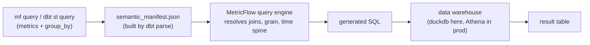

# MetricFlow in this project

MetricFlow is dbt Labs' semantic layer engine. It solves a specific problem:
once a metric like "revenue" is computed in more than one place (a
dashboard's SQL, an analyst's notebook, a second dashboard), those
definitions drift — different filters, different grains, different handling
of refunds — and nobody can agree on "the" revenue number. MetricFlow moves
the definition into the dbt project itself, next to the models it's derived
from, and generates the SQL for it on demand instead of having it copy-pasted
everywhere.

You describe two things in YAML on top of existing dbt models:

1. **Semantic models** — which columns on a model are join keys (entities),
   which are group-by attributes (dimensions), and which are raw aggregations
   (measures).
2. **Metrics** — named, queryable combinations of measures (plus optional
   filters, ratios, or expressions over other metrics).

A consumer then asks for `metrics=[revenue], group_by=[metric_time__month]`
and MetricFlow — knowing the grain, the join paths, and the time spine —
compiles that into a single SQL query against the dbt models, correctly
joining and aggregating without the caller having to know the underlying
table structure at all.

## How a query actually runs



`dbt parse` compiles every `semantic_models:`/`metrics:`/`saved_queries:`
block across the project into one manifest
(`target/semantic_manifest.json`). The query engine (`mf`, or `dbt sl` in
dbt Cloud) never touches your raw SQL files directly — it reasons entirely
over that manifest, then emits SQL and runs it through the warehouse
connection defined in `profiles.yml`.

## Core concepts

- **Semantic model** — maps a dbt model (via `model: ref(...)`) to the
  entities, dimensions, and measures MetricFlow can query against it. One per
  mart, roughly.
- **Entity** — a join key (`primary`, `foreign`, `unique`). MetricFlow uses
  these to auto-join semantic models when a query spans more than one, so
  callers never write a `JOIN` by hand.
- **Dimension** — an attribute to group or filter by. `categorical` (a plain
  column) or `time` (requires a `time_granularity`, and can be queried at any
  coarser granularity — day data grouped by month, quarter, year).
- **Measure** — a raw aggregation over a column (`sum`, `count_distinct`,
  `average`, `median`, ...). Measures aren't queried directly; metrics wrap
  them.
- **Metric** — the queryable unit. Types used in this project:
  - `simple` — one measure, optionally filtered.
  - `ratio` — numerator measure / denominator measure (e.g. category revenue
    as a % of total revenue).
  - `derived` — an expression over other metrics. Supports `offset_window`
    (e.g. "this metric, 1 month ago") for period-over-period comparisons
    without writing a self-join.
  - `cumulative` — running total of a measure over time.
- **Saved query** — a named, reusable `metrics` + `group_by` combination, so
  a common report doesn't need its parameters retyped every time.
- **Time spine** — a model of one row per calendar day, used by MetricFlow to
  fill date gaps and align time-based joins/offsets (derived metrics with
  `offset_window`, cumulative metrics without activity every day, etc.).

## Where this lives in the repo

Semantic layer YAML is colocated with the mart it describes, under
`dbt/models/marts/*.yml`, alongside the existing column/test definitions —
not in separate files. The time spine is a real dbt model:
`dbt/models/marts/metricflow_time_spine.sql` (built from
`dbt_date.get_base_dates`, 10 years of days).

| Mart | Semantic model | Grain | Notable metrics |
|---|---|---|---|
| `orders.yml` | `orders` | one row per order | `order_total`, `orders`, `new_customer_orders`, `large_orders`, `food_orders`, `drink_orders` |
| `order_items.yml` | `order_item` | one row per order item | `revenue`, `food_revenue`, `drink_revenue` (simple); `food_revenue_pct`, `drink_revenue_pct` (ratio); `revenue_growth_mom`, `order_gross_profit` (derived); `cumulative_revenue` (cumulative) |
| `customers.yml` | `customers` | one row per customer | `lifetime_spend_pretax`, `count_lifetime_orders` (simple); `average_order_value` (derived) |
| `locations.yml` | `locations` | one row per location | dimension-only (`average_tax_rate` measure, no metric defined yet) |
| `products.yml` | `products` | one row per product | dimension-only, no measures/metrics defined |
| `supplies.yml` | `supplies` | one row per supply/product combo | dimension-only, no measures/metrics defined |

Entities chain these together — e.g. `orders` has a `customer` foreign entity
(`expr: customer_id`) and a `location` foreign entity, so a query can join
`order_total` (from `orders`) by `location_name` (from `locations`) without
either semantic model mentioning the other directly.

Three saved queries currently exist: `order_metrics` (on `orders.yml`),
`revenue_metrics` (on `order_items.yml`), and `customer_order_metrics` (on
`customers.yml`).

## Status on this branch

`worktree-metricflow` has the full local `mf` CLI installed and verified
against the seeded duckdb warehouse — every example below is real output
from this branch, not hypothetical.

`main` does not have this: `dbt-metricflow`'s latest release (0.13.0) pins
`dbt-core<1.12.0`, but `main` runs dbt-core 1.12.0. Installing it there
downgrades dbt-core to 1.11.12, which pulls in `mashumaro<3.15` — and
mashumaro `<3.15` crashes on Python 3.14 (`UnserializableField` on
`Optional[str]` in `JSONObjectSchema`) with a `dbt --version` traceback,
breaking the CLI outright.

This branch fixes that with a `[tool.uv]` override in `pyproject.toml`:

```toml
[tool.uv]
override-dependencies = ["mashumaro[msgpack]>=3.17"]
```

This is safe, not a hack around a real incompatibility: dbt-common (the
actual consumer of mashumaro) only requires `<4.0,>=3.9` — dbt-core
1.11.12's `<3.15` upper bound is just stale relative to Python 3.14, and
`>=3.17` is well within dbt-common's own allowed range.

Net effect on this branch: dbt-core is pinned to 1.11.12 instead of 1.12.0.
See `MF.md`'s git history (or the parent session) for what that trades away
— mainly 1.12's semantic-layer YAML parsing improvements and `.env`/`vars.yml`
support, none of which this project currently uses.

## Examples (real output, this branch)

All commands below run from the repo root (not `dbt/` — see the gotcha at
the end) with `DBT_PROJECT_DIR=dbt DBT_PROFILES_DIR=dbt`, after `task gen`,
`task seed`, and `task run` have populated the local duckdb warehouse.

Simple metric, grouped by day:

```bash
$ mf query --metrics order_total --group-by metric_time__day --order metric_time__day --limit 5
metric_time__day       order_total
-------------------  -------------
2018-09-01T00:00:00         707
2018-09-02T00:00:00         900.99
2018-09-03T00:00:00         572.38
2018-09-04T00:00:00         502.43
2018-09-05T00:00:00         506.65
```

Ratio metric, grouped by month:

```bash
$ mf query --metrics food_revenue_pct --group-by metric_time__month --order metric_time__month --limit 3
metric_time__month      food_revenue_pct
--------------------  ------------------
2018-09-01T00:00:00             0.377853
2018-10-01T00:00:00             0.40016
2018-11-01T00:00:00             0.395258
```

Derived metric (an expression over two other metrics, `revenue - order_cost`):

```bash
$ mf query --metrics order_gross_profit --group-by metric_time__month --order metric_time__month --limit 3
metric_time__month      order_gross_profit
--------------------  --------------------
2018-09-01T00:00:00                13796.5
2018-10-01T00:00:00                18802.9
2018-11-01T00:00:00                22909.4
```

A saved query (pre-defined metrics + group-by, one flag instead of three):

```bash
$ mf query --saved-query customer_order_metrics --limit 3
customer                                count_lifetime_orders    lifetime_spend_pretax    average_order_value
------------------------------------  -----------------------  -----------------------  ---------------------
70805a66-5bfa-4347-b7a3-a57cf27eb5e8                      376                    13181                35.0559
5e696b87-b2f2-41af-8280-a0372ce872ac                      370                    13048                35.2649
f0dbef3d-faf6-4dd4-aa82-dde5f9fb1146                      879                    18452                20.992
```

Discover what's queryable — no need to open the YAML:

```bash
$ mf list metrics
• order_total: customer__customer_name, customer__customer_type, ..., location__location_name, metric_time, ...
• food_revenue_pct: metric_time, order_id__customer__customer_name, ...
...19 metrics total

$ mf list dimensions --metrics order_total
• customer__customer_name
• customer__customer_type
• location__location_name
• location__opened_date
• metric_time
• order_id__is_food_order
• order_id__is_drink_order
...
```

Validate the whole semantic layer against the live warehouse (manifest
semantics, and that every entity/dimension/measure/metric actually resolves
to real columns):

```bash
$ mf validate-configs
✔ Successfully parsed manifest from dbt project
✔ Successfully validated the semantics of built manifest (ERRORS: 0, WARNINGS: 1)
✔ Successfully validated semantic models against data warehouse (ERRORS: 0)
✔ Successfully validated dimensions against data warehouse (ERRORS: 0)
✔ Successfully validated entities against data warehouse (ERRORS: 0)
✔ Successfully validated measures against data warehouse (ERRORS: 0)
✔ Successfully validated metrics against data warehouse (ERRORS: 0)
```

## Use cases

- **Ad hoc analysis without writing SQL.** `mf query --metrics revenue
  --group-by metric_time__week,location__location_name` answers "weekly
  revenue by store" without anyone hand-writing the join between
  `order_items` and `locations`.
- **One metric definition, many consumers.** A BI tool wired to the dbt
  Semantic Layer (via `dbt sl` in dbt Cloud, or any MetricFlow-compatible
  client) gets the same `order_gross_profit` as someone running `mf query`
  locally — no divergent copy of the "revenue minus cost" logic per tool.
- **Period-over-period comparisons for free.** `revenue_growth_mom` is a
  `derived` metric using `offset_window: 1 month` — MetricFlow handles the
  self-join against the time spine; the YAML just states the two metrics and
  an expression.
- **Cumulative/running totals without window-function boilerplate.**
  `cumulative_revenue` is declared once as a `cumulative` metric type rather
  than hand-written as a `SUM() OVER (ORDER BY ...)` in every report that
  needs it.
- **CI validation of the semantic layer.** `mf validate-configs` (or, without
  the package, plain `dbt parse`) catches a typo'd dimension or a measure
  pointing at a dropped column before it ships to a dashboard, the same way
  `dbt test` catches a broken data test.
- **Safe metric access for LLMs/agents.** Because metrics are declared with
  their valid dimensions and filters up front, a tool-calling agent can be
  restricted to `mf query`/`dbt sl query` against known metrics instead of
  writing arbitrary SQL against raw tables — it can't silently double-count
  a join or miscompute a ratio.

## Working with it without installing dbt-metricflow (main)

The semantic layer YAML can be validated on dbt-core alone, no extra package
needed — this works identically on `main` (dbt-core 1.12.0):

```bash
uv run dbt parse --project-dir dbt --profiles-dir dbt
```

```bash
uv run python -c "
import json
d = json.load(open('dbt/target/semantic_manifest.json'))
print([m['name'] for m in d['metrics']])
"
```

This confirms the YAML compiles and is internally consistent, but can't
actually execute a query or validate against live warehouse columns — that
needs `mf`/`dbt-metricflow`, i.e. this branch.

## Gotchas

- **`mf`'s duckdb path is cwd-relative, not `--project-dir`-relative.** Run
  it from the repo root (matching how `Taskfile.yml`/`Makefile` invoke
  `dbt`), not from inside `dbt/` — otherwise it creates a second, empty
  `dbt/jaffle_shop.duckdb` instead of finding the real one at the repo root.
- **There's an unrelated `mf` on `PATH`** from TeX/Metafont
  (`/Library/TeX/texbin/mf`). Always invoke the venv's copy explicitly
  (`.venv/bin/mf` or `uv run mf`), never bare `mf`.
- **dbt-core is pinned to 1.11.12 on this branch, not 1.12.0.** Don't merge
  this pin to `main` without re-checking whether `dbt-metricflow` has since
  shipped `dbt-core>=1.12` support — the whole point of the override was to
  unblock local experimentation, not to permanently downgrade the project.
